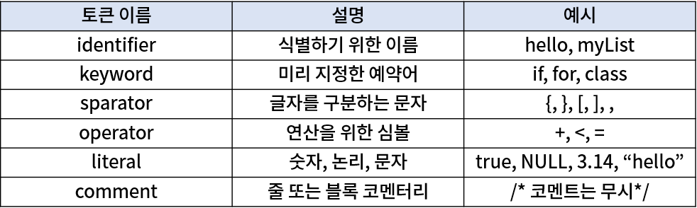

# tokenizer

문자열을 **의미있는 단위로 분리**하는 역할을 수행한다. 여기서 의미있는 단위는 보통 토큰(token)이라고 하며, 프로그래밍 언어에서 사용하는 토큰의 종류는 다음과 같다.
<br>



<br>

# lexer

tokenizer를 거친 후의 **분리된 데이터에 의미를 부여**하는 역할을 수행한다.

의미는 임의로 지정되는 것 같으나, 웬만하면 convention을 따르는 것이 좋아 보인다. 근데 convention을 찾기가 쉽지 않다... 😂

<br>

# parser

lexer를 거친 후의 **의미가 부여된 데이터를 구조화**시키는 역할을 수행한다.

<br>

### 문자열을 예시로 들면?

```jsx
const str = "[1, [2,[3]],'hello', 'world', null]";
```

<br>

### (1) tokenizer를 거친 후의 상태

> ['`[`', '`1`', '`[`', '`2`', '`[`', '`3`', '`]`', '`]`', "`'hello'`", "`'world'`", `null`, '`]`']

<br>

### (2) lexer를 거친 후의 상태

> [ { type : '`LeftSquareBracket`', value : '`[`' },<br>
> { type : '`number`', value :'`1`' },<br>
> { type : '`LeftSquareBracket`', value : '`[`' },<br>
> { type : '`number`', value : '`2`' },<br>
> { type : '`LeftSquareBracket`', value : ''`[`'' },<br>
> { type : '`number`', value :'`3`' },<br>
> { type : '`RightSquareBracket`', value : '`]`' },<br>
> { type : '`RightSquareBracket`', value : '`]`' },<br>
> { type : '`string`', value : '`hello`' },<br>
> { type : '`string`', value : '`world`' },<br>
> { type : '`NULL`', value : '`null`' },<br>
> { type : '`RightSquareBracket`', value : '`]`' } ]

<br>

### (3) parser를 거친 후의 상태

- 짝이 맞는 괄호 (LeftSquareBracket - RightSquareBracket, LeftBraces - RightBraces)들이 존재할 경우, 그 사이에 있는 데이터들은 child로 넣어 준다.
- 그렇지 않은 경우, child는 `[]`이다.

  → 구현하다 보니 child는 lexer에서 넣어주고 오는 것이 맞는 것 같고, LeftSquareBracket과 RightSquareBracket을 array와 arrayClose로 바꿔주는 것이 맞는 것 같다.

```
{ type: 'array',
  child:
  [
    { type: 'number', value: '1', child: [] },
    { type: 'array', child: [
      { type: 'number', value: '2', child: [] },
      { type: 'array', child: [
        { type: 'number', value: '3', child: [] },
      ]},
    ]},
    { type: 'string', value: 'hello', child: [] },
    { type: 'string', value: 'world', child: [] },
    { type: 'NULL', value: 'null', child: [] }
  ]
}
```

<br>

_reference_

[[PROJECT] Array Parser 만들기 - (1) 기본 개념 정리](https://pa-pico.tistory.com/91)

[lucas - Day7-Array-분석기 배경 지식](https://lucas.codesquad.kr/boostcamp-2020/course/Challenge-JS/Day7-Array-%EB%B6%84%EC%84%9D%EA%B8%B0/%EB%B0%B0%EA%B2%BD-%EC%A7%80%EC%8B%9D)

_추가적으로 보면 좋을 reference_

[새로운 Smart Contract 프로그래밍 언어 만들기 — Lexer](https://medium.com/teamnexters/koa%ED%8C%80-%EA%B0%9C%EB%B0%9C%EC%9E%90-%EC%A3%BC%EA%B0%84-%EB%AF%B8%EC%85%98-2-938634d86921)

[새로운 Smart Contract 프로그래밍 언어 만들기 — Parser](https://medium.com/teamnexters/%EC%83%88%EB%A1%9C%EC%9A%B4-smart-contract-%ED%94%84%EB%A1%9C%EA%B7%B8%EB%9E%98%EB%B0%8D-%EC%96%B8%EC%96%B4-%EB%A7%8C%EB%93%A4%EA%B8%B0-parser-579b319926d6)
