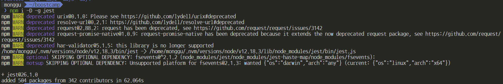

# JEST

### ⚠️ jest 설치 과정 및 환경 설정 방법 ⚠️

1. `npm`을 통해 `jest`설치

- 주의할 점 : npm은 기본적으로 로컬에 설치하기 때문에 글로 설치를 위해 `-g` 옵션을 달아줘야 한다. 추후에 계속 이용할 것이기 때문에 글로벌로 해놓는 것이다. [[링크1]](https://www.zerocho.com/category/NodeJS/post/58285e4840a6d700184ebd87) [[링크2]](https://velopert.com/241)
- `-D` (혹은 `--save-dev`) 옵션을 주면 `devDependencies`에 추가되는데, 글로벌로 설치하면 굳이 `devDependencies`에 추가를 해줘야 하는 것일까? 아직은 잘 모르기 때문에 두 개의 옵션을 다 주기로 결정했다.

  ```
  $ npm i -D -g jest
  ```

  

<br>

2.  이후 아래 명령어를 통해 `package.json` 파일을 생성

    ```
    $ npm init -y
    ```

<br>

3. `package.json` 파일을 열어 `test` script를 `jest`로 변경

   이렇게 하게 될 경우, `test.js` 파일을 `npm test`라는 명령어 말고 `jest`라는 명령어만으로 테스팅할 수 있다. 참고로 `npm test`는 `test.js`로 끝나거나 `__test__` 디렉토리 안에 있는 파일들을 테스팅한다.

<br>

### ⚠️테스트 코드 패턴 ⚠️

    ```jsx
    test("테스트 설명", () => {
    	expect("검증 대상").toXxx(기대 결과")
    })
    ```

- `toXxx` 부분에서 사용되는 함수를 흔히 `Test Mathcher`라고 한다.

<br>

### 자주 사용되는 Matcher

- toEqaul( ) : 검증 대상인 두 객체가 동일하다면 테스트 통과
- toBeTruthy( ) : 검증 대상이 true로 간주되면 테스트 통과
- toBeFalsy ( ) : 검증 대상이 false로 간주되면 테스트 통과
- toHaveLength( ) : 배열의 길이가 존재하면 테스트 통과
- toContain( ) : 배열에 특정 원소가 들어있으면 테스트 통과
- toMatch( ) : 정규식 기반의 문자열이 일치한다면 테스트 통과
- toThrow( ) : 예외가 발생한다면 테스트 통과
